## 👋 Hey, I'm Shubham!

🚀 Full Stack • Platform Engineering • Backend • DevOps  
💡 Passionate about automation, reliability, infra design & open-source engineering.

---

## 🌐 Connect With Me

---

## 🧩 GitHub Stats  

## 🛠️ Top Languages  

---
## 🧑‍💻 Languages I Work With

---

## ⚙️ Tech Stack & Tools

### 🛠 DevOps / Cloud / Infra  

### 🧰 Backend & Tools  

---

## 🤝 Open Source & Collaboration

💙 I actively contribute to **DevOps, Infra, and Tooling** projects.  
🔍 I enjoy debugging deep issues, refactoring modules, and improving DX/UX.  
✨ Always open to collaborating on:  
- DevOps / SRE / Automation  
- Infra tooling  
- Backend utilities  
- Rust + Go projects  
- Any impactful OSS work  

📬 **If you have something cool, DM me — let’s build together.**

### 🛠️ WIP
Taking a small break. More updates coming soon... ⏳
